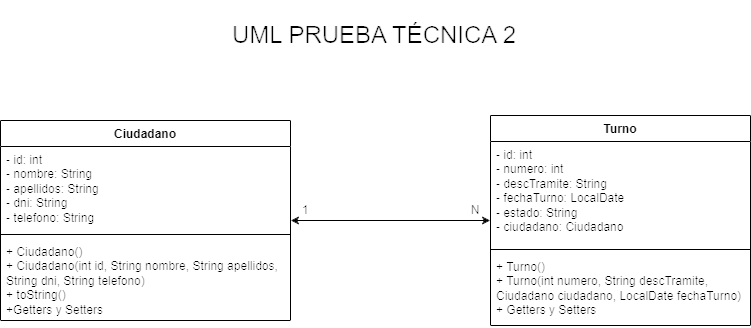

# Aplicación de Gestión de Turnos para Incidencias
## Descripción
Esta aplicación web Java ofrece una solución simple para gestionar turnos relacionados con incidencias. Permite a los usuarios agregar nuevos ciudadanos, registrar turnos de incidencias y visualizar la lista de turnos.

## Funcionalidades
- Agregar Ciudadano: La página "Agregar Ciudadano" proporciona un formulario para ingresar los detalles de un nuevo ciudadano, incluyendo nombre, apellidos, DNI y número de teléfono.

- Reportar Incidencia (Agregar Turno): Desde la página "Reportar Incidencia", los usuarios pueden agregar un nuevo turno en base al usuario creado con información como número de turno, fecha y descripción del trámite.

- Listar Turnos: La página "Listado de Turnos" permite a los usuarios filtrar y visualizar la lista de turnos existentes según la fecha y el estado (En espera o Ya atendido). También proporciona la opción de solucionar incidencias marcando los turnos como "Ya atendidos".

## Estilo y Diseño
El diseño de la interfaz utiliza un estilo sobrio y limpio para una fácil navegación. Se han aplicado estilos CSS consistentes a través de las páginas para mantener una apariencia armoniosa. A continuación, se describen algunos aspectos del diseño:

- Estilo de Tabla: La tabla de turnos permite tanto visualizar el contenido como cambiar el estado del turno a "Ya atendido". Una vez se ha "atendido" el turno, desaparece la posibilidad de modificación ya que se considera carente de sentido que una incidencia ya atendida pueda volver al estado "En espera". 

- Botones y Formularios: Se han diseñado botones y formularios y se han utilizado confirmaciones para acciones importantes.

## Uso
- Agregar Ciudadano:

    - Accede a la página "Agregar Ciudadano" desde La página principal.

    - Completa el formulario con la información del nuevo ciudadano.
    - Haz clic en "Agregar ciudadano" para registrar la información.
- Reportar Incidencia (Agregar Turno):

    - Accede a la página "Reportar Incidencia" desde agregar_ciudadano.
    - Completa el formulario del nuevo turno con los detalles requeridos.
    - Haz clic en "Agregar Turno" y confirma la acción.
    - En este punto se muestra un mensaje de "Turno creado con éxito". Debemos volver atrás si se desea agregar otro turno para el mismo usuario.

- Listar Turnos:

    - Accede a la página "Listado de Turnos" desde la página principal.
    - Filtra la lista de turnos por fecha y estado utilizando los controles proporcionados.
    - También se da la posibilidad de filtrar la lista según su estado("Ya atendido" o "En espera").Este filtrado trabaja sobre la lista ya filtrada por fecha como se pide en los requerimientos.

    - Haz clic en "Mostrar turnos" para visualizar la lista filtrada.

    - Para solucionar incidencias, haz clic en "Solucionar Incidencia" junto al turno correspondiente.
    - Tras solucionar la incidencia, se refrescará la lista mostrándola al completo para que el usuario pueda ver los cambios.

## Estructura del proyecto
### Lógica
Este proyecto cuenta con dos clases lógicas:
- La clase Ciudadano que incluye Id, nombre, apellidos, dni y telefono con sus constructores y métodos getters y setters.
- La clase Turno que contiene los atributos Id, número, descripción del trámite*, fecha, estado y ciudadano(con una relación ManyToOne). 
- Clase Controladora que sirve de intermediaria entre ControladoraPersistencia y los servlets.
*Se contempló la posibilidad de hacer una clase Tramite pero se descartó la idea en favor de poner el trámite como un atributo.

### Persistencia
El paquete persistencia contiene las siguientes clases:
- CiudadanoJpaController
- TurnoJpaController
- ControladoraPersistencia: Clase que sirve de intermediaria entre los controladores JPA y la clase Controladora del paquete de lógica.

### Servlets
Este paquete incluyen los servlets que se encargan del manejo de solicitudes del cliente. Se incluyen los siguientes:
- SvCiudadano
- SvTurno

### JavaServer Pages
Páginas web que incluye el proyecto:
- index.jsp: Página principal desde la que se puede acceder a agregar_ciudadano o listar_turnos.
- agregar_ciudadano.jsp: Formulario que permite crear un ciudadano y te redirige a agregar_turno.
- agregar_turno.jsp: Formulario que permite crear turnos en base al usuario previamente creado.
- listar_turnos.jsp: Página que muestra la tabla de turnos permitiendo el filtrado por fecha y estado.

## Diagrama UML

## Requisitos
- Java 8 o superior
- Maven
- Contenedor Servlet (por ejemplo, Apache Tomcat)
- Base de datos MySQL

## Configuración de la Base de Datos
- Configura la conexión a la base de datos en el archivo persistence.xml.
